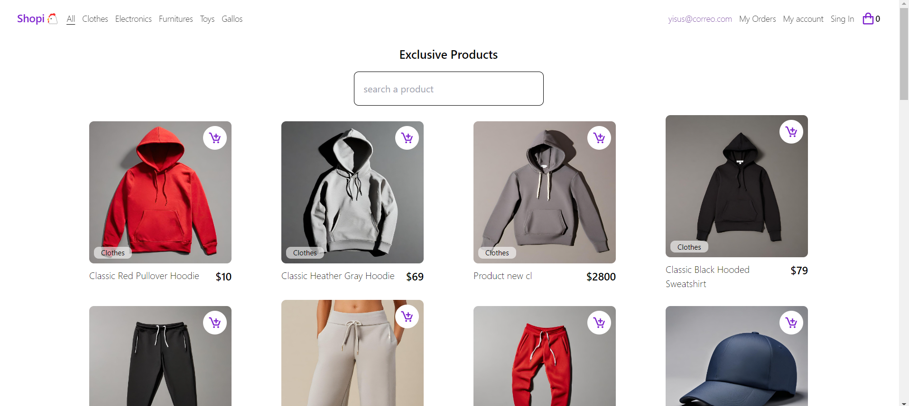

<h1 align="center" color="purple"> e-commerce on react</h1>

The app has some issues that i need to solve

#12 Maquetación de las vistas de usuario 
Hace falta crear el flujo de Sign In:

 Página para hacer login (si el usuario no está autenticado)
 Página de Sign up para crear un nuevo usuario (si el usuario no está autenticado)
 Página con la información del usuario y botón para hacer logout (si el usuario ya está autenticado)

#13 Navbar Dinámica (completed)
La navbar o menú principal de la aplicación debe cambiar su estructura dependiendo de si el usuario está autenticado o no:

 Mostrar el correo del usuario (si ya está autenticado)
 Mostrar botón para hacer Sign (si no está autenticado)

#14 Protección de Rutas 
 Las rutas de Checkout, Órdenes de compra y Visualización de productos NO deben ser visibles para usuarios sin autenticar:

 Hacer redirect a la página de login si el usuario no está autenticado
 Mostrar común y corriente las páginas anteriormente mencionadas si el usuario ya está autenticad 

#15 Responsive Design para Shopi
